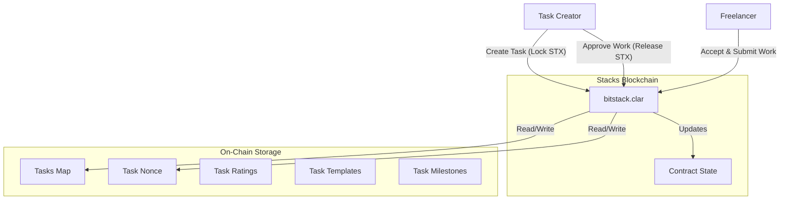
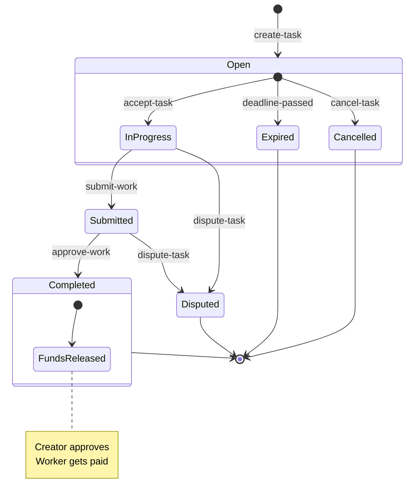

# BitStack - Decentralized Microgigs Marketplace

**BitStack** is a decentralized tasks marketplace built on **Stacks (Bitcoin L2)**. It enables users to post tasks with rewards paid in STX or sBTC, and allows workers to complete these tasks and get paid trustlessly via smart contracts.

  

## 🚀 New Features

- **Task Priorities**: Set task priority levels (Low, Normal, High)
- **Task Categories**: Organize tasks by category (Design, Development, Marketing, Writing)
- **Task Disputes**: Built-in dispute resolution system
- **Task Cancellation**: Cancel tasks with automatic refunds
- **Task Expiration**: Automatic handling of expired tasks
- **Enhanced UI**: Modern React components with Tailwind CSS
- **Real-time Updates**: Live task status monitoring
- **Comprehensive Testing**: Full test coverage for contracts and UI

## 🏗 System Architecture

The project consists of a Clarity smart contract (`bitstack`) that manages the state of all tasks and holds funds in escrow. Users interact with the contract directly or through a Next.js frontend application.



## 🔄 Enhanced Workflow

The lifecycle of a task follows an enhanced flow with dispute resolution and cancellation options.



## ✨ Features

- **Create Tasks**: Users can post tasks with title, description, deadline, STX reward, priority, and category
- **Task Management**: Accept, submit work, approve, dispute, and cancel tasks
- **Trustless Escrow**: Funds are locked in the smart contract upon task creation
- **Dispute Resolution**: Built-in dispute system for task conflicts
- **Task Expiration**: Automatic handling of expired tasks with refunds
- **Task Ratings**: Rate completed tasks for reputation building
- **Task Templates**: Reusable task templates for common task types
- **Milestone Payments**: Support for milestone-based task payments
- **Task Collaboration**: Multi-worker task support
- **Real-time UI**: Modern React interface with live updates
- **Comprehensive Testing**: Full test coverage for reliability
- **Security**: Leveraging Bitcoin's security through Stacks PoX mechanism

## 🛠 Prerequisites

Ensure you have the following installed:

- [Node.js](https://nodejs.org/) (v18+)
- [Clarinet](https://github.com/hirosystems/clarinet) (for local smart contract dev)
- [Git](https://git-scm.com/)

## 🚀 Installation

1.  **Clone the repository**
    ```bash
    git clone https://github.com/Cyberking99/BitStack.git
    cd BitStack
    ```

2.  **Install Frontend Dependencies**
    ```bash
    cd frontend
    npm install
    ```

3.  **Configure Environment Variables**
    Create a `.env.local` file in the `frontend` directory:
    ```bash
    cd frontend
    echo "NEXT_PUBLIC_STACKS_NETWORK=testnet" > .env.local
    echo "NEXT_PUBLIC_CONTRACT_ADDRESS=your-contract-address" >> .env.local
    ```
    
    Set `NEXT_PUBLIC_STACKS_NETWORK` to `testnet` for development or `mainnet` for production.

## 🧪 Testing

Detailed testing instructions for smart contracts can be found in [contracts/README.md](contracts/README.md).

Run tests:
```bash
# Contract tests
cd contracts
npm test

# Frontend tests  
cd frontend
npm test
```

## 📜 Deployment

The project includes scripts to facilitate deployment to the Stacks network (Testnet/Mainnet).

1.  **Configure Environment**
    Ensure your `Clarinet.toml` and settings files are set up.

2.  **Run Deploy Script**
    ```bash
    clarinet deploy --config Clarinet.toml --settings settings/Testnet.toml
    ```

## 💻 Usage

### Smart Contract Functions

| Function | Type | Description |
| :--- | :--- | :--- |
| `create-task` | Public | Creates a new task with title, description, reward, deadline, priority, and category |
| `get-task` | Read-Only | Retrieves details of a specific task |
| `get-nonce` | Read-Only | Retrieves the current total number of tasks |
| `accept-task` | Public | Assigns a worker to an open task |
| `submit-work` | Public | Submits proof of work for a task in progress |
| `approve-work` | Public | Approves submitted work and releases payment to worker |
| `dispute-task` | Public | Creates a dispute for a task |
| `cancel-task` | Public | Cancels an open task and refunds creator |
| `rate-task` | Public | Rate a completed task |
| `is-task-expired` | Read-Only | Check if a task has expired |

### Frontend Components

- **TaskCard**: Display task information with action buttons
- **TaskForm**: Create new tasks with all parameters
- **TaskList**: Browse and filter tasks
- **TaskDetails**: View detailed task information
- **WalletConnect**: Connect/disconnect Stacks wallet
- **UserProfile**: View user statistics and reputation

See [Frontend Documentation](frontend/README.md) for UI components and usage.

## 🤝 Contributing

Contributions are welcome! Please see [CONTRIBUTING.md](CONTRIBUTING.md) for guidelines.

## 📄 License

This project is licensed under the MIT License.

## 📋 Changelog

See [CHANGELOG.md](CHANGELOG.md) for recent updates.
